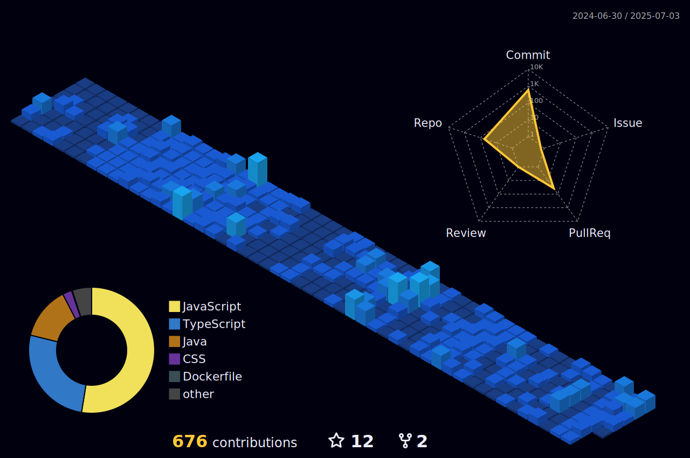

<h1 align="center">
    
</h1>

<h3 align="center">Building scalable, high-performance web apps, one bug at a time. Always learning, always innovating—because nothing’s ever ‘done’ in code, right?</h3>

 

<h2 align="center"> About Me </h2>

 
 💬 Ask me about **MERN**

📫 How to reach me **sayanpalb@gmail.com**

⚡ Fun fact **I admire Peter Parker more than Tony Stark!**

 

  

<h2 align="center">🖥️ Experience 🖥️</h2>

        <table border="1">
        <tr>
            <th>💼 Designation</th>
            <th>🏢Organization</th>
            <th>⏰Timeline </th>
        </tr>
        <tr>
            <td><b>Software Developer Intern</b></td>
            <td><a href="https://www.pephub.tech/"><b>Pephub</b></a></td>
            <td><b>Aug 2023 - Nov 2023</b></td>
        </tr>
        <tr>
            <td><b>Web Developer Intern</b></td>
            <td><a href="https://www.linkedin.com/company/v-books/?originalSubdomain=in"><b>V-Books</b></a></td>
            <td><b>July 2023 - Sept 2023</b></td>
        </tr>
    </table>

 

<h2 align="center">🙋‍♂️ Volunteering 🖥️</h2>

        <table border="1">
        <tr>
            <th>💼 Designation</th>
            <th>🏢Organization</th>
            <th>⏰Timeline </th>
        </tr>
        <tr>
            <td><b>Student Coordinator</b></td>
            <td><a href="https://gdg.community.dev/gdg-on-campus-university-of-engineering-management-kolkata-india/"><b>GDG UEMK</b></a></td>
            <td><b>Oct 24 - Present</b></td>
        </tr>
        <tr>
            <td><b>Event Coordinator</b></td>
            <td><a href="https://ureckon.uem.edu.in/"><b>Ureckon</b></a></td>
            <td><b>Jan 24 - Feb 24</b></td>
        </tr>
        <tr>
            <td><b>Web Developer</b></td>
            <td><a href="https://ureckon.uem.edu.in/"><b>Ureckon</b></a></td>
            <td><b>Dec 23 - Feb 24</b></td>
        </tr>
    </table>

 

<h2 align="center"> Achievements 🏆🎉 </h2>

        
Won <b>1st</b> Prize in <a href="https://www.linkedin.com/posts/sayan-snigdha-pal_winner-webdevelopment-grateful-activity-7246589971577331712-sIes?utm_source=share&utm_medium=member_desktop">Orion Web Dev Hackathon 2024</a> 
         
Won <b>2nd</b> Prize in <a href="https://devpost.com/software/my-listed-habits-mlh">Hacky New Year Hackathon 2023</a>
 
<a href="https://www.linkedin.com/posts/sayan-snigdha-pal_hacktoberfest2022-hacktoberfest-swags-activity-7031565461225947136-XUbn?utm_source=share&utm_medium=member_desktop">Digital Ocean Hacktoberfest Qualified (2022)</a>        

 

<h2 align="center">⚒️ Languages-Frameworks-Tools ⚒️</h2>
 

        
         
        
            
        
         
        
 

<h2 align="center">⚡ Stats ⚡</h2>

  
  
   
  

 

    

<h2 align="center">🌐 Socials</h2>

 
  
  

  

